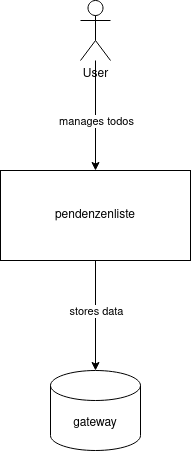
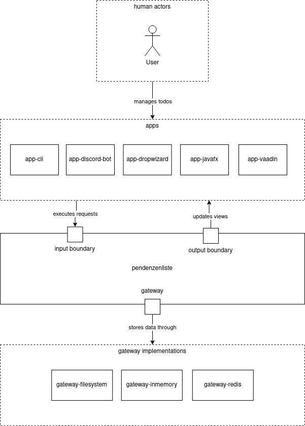
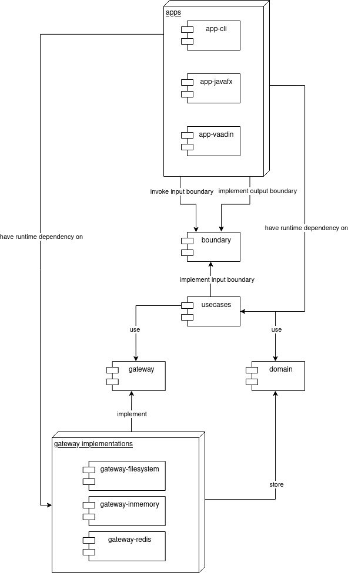

# Pendenzenliste

**About arc42**

arc42, the template for documentation of software and system
architecture.

Template Version 8.1 EN. (based upon AsciiDoc version), May 2022

Created, maintained and © by Dr. Peter Hruschka, Dr. Gernot Starke and
contributors. See <https://arc42.org>.

# Introduction and Goals

Pendenzenliste is a highly over-engineered application that can be used to manage todos.
The main goal of the project is to exercise designing a non-trivial application in a CLEAN-Architecture.

The users of the application define for themselves how they want to run the application.
This may mean that the app can be run in e.g. a web, CLI or android app.
If the user desires it the user should be able to synchronize the data between multiple of his personal devices.

## Requirements Overview

| ID                                                            | Requirement               | Description                                                                                                                             | Implemented |
|---------------------------------------------------------------|---------------------------|-----------------------------------------------------------------------------------------------------------------------------------------|-------------|
| M-1                                                           | Create todo               | Users should be able to create their todos                                                                                              | Yes         |
| M-2                                                           | Delete todo               | Users should be able to delete their todos                                                                                              | Yes         |
| M-3                                                           | Complete todo             | Users should be able to complete their todos                                                                                            | Yes         |
| M-4                                                           | Reset todo                | Users should be able to reset a previously completed todo                                                                               | Yes         |
| M-5                                                           | List todos                | Users should be able to list their todos                                                                                                | Yes         |
| M-6                                                           | Fetch todo                | Users should be able to fetch a specific todo                                                                                           | Yes         |
| M-7                                                           | Update todo               | Users should be able to update their open todos                                                                                         | Yes         |
| M-8                                                           | Storage gateway           | The application should have some kind of storage gateway to store the todos                                                             | Yes         |
| O-1                                                           | In-memory storage gateway | The application should support an in-memory storage gateway                                                                             | Yes         |
| [O-2](https://github.com/flens-dev/pendenzenliste/issues/1)   | File storage gateway      | The application should support a file storage gateway to persistently store todos                                                       | Yes         |
| [O-3](https://github.com/flens-dev/pendenzenliste/issues/2)   | Redis storage gateway     | The application should support a redis storage gateway to persistently store todos                                                      | Yes         |
| [O-4](https://github.com/flens-dev/pendenzenliste/issues/10)  | REST storage gateway      | The application should support a REST storage gateway to persistently store todos                                                       | No          |
| M-9                                                           | App                       | The pendenzenliste should be bundled into an application                                                                                | Yes         |
| O-5                                                           | javafx app                | The pendenzenliste should be bundled into a javafx application                                                                          | Yes         |
| [O-6](https://github.com/flens-dev/pendenzenliste/issues/7)   | vaadin app                | The pendenzenliste should be bundled into a vaadin application                                                                          | Yes         |
| [O-7](https://github.com/flens-dev/pendenzenliste/issues/12)  | cli app                   | The pendenzenliste should be bundled into a command line interface application                                                          | Yes         |
| [O-8](https://github.com/flens-dev/pendenzenliste/issues/13)  | i18n                      | The pendenzenliste should be translated into german and english                                                                         | No          |
| [O-9](https://github.com/flens-dev/pendenzenliste/issues/9)   | achievements              | The user should be able to earn achievements by interacting with the application                                                        | Yes         |
| [O-10](https://github.com/flens-dev/pendenzenliste/issues/16) | statistics                | Users should be able to view statistics of their usage                                                                                  | No          |
| [O-11](https://github.com/flens-dev/pendenzenliste/issues/17) | android app               | The pendenzenliste should be bundled into an android app                                                                                | No          |
| [M-10](https://github.com/flens-dev/pendenzenliste/issues/18) | subscribe todo list       | The user should be able to subscribe to a list of todos to update the displayed todos when another app or user updates the stored todos | Yes         |
| [O-12](https://github.com/flens-dev/pendenzenliste/issues/35) | Discord Bot               | The pendenzenliste should be accessible by interacting with a discord bot                                                               | Yes         |

Legend:

```
M = Must have requirement
O = Optional requirement
```

## Quality Goals

| ID  | Priority | Quality goal  | Description                                                                                                                 |
|-----|----------|---------------|-----------------------------------------------------------------------------------------------------------------------------|
| Q-1 | 1        | Extendability | The application should be easily extended by adding new frontend applications or gateways to support different technologies |
| Q-2 | 2        | Learnability  | The application should be self explanatory to the end users                                                                 | 

## Stakeholders

| Role/Name | Goal                                                               | Expectations |
|-----------|--------------------------------------------------------------------|--------------|
| User      | Wants to configure the app to his needs and it to manage his todos |              |

# Architecture Constraints

| ID   | Description                                                     | 
|------|-----------------------------------------------------------------|
| AC-1 | The application should follow the CLEAN architecture principles |

# System Scope and Context

## Business Context



| Neighbour              | Description                                                              |
|------------------------|--------------------------------------------------------------------------|
| user                   | Manages his todos via the applications                                   |
| gateway implementation | Is accessed by the application to store and retrieve the users todo data |

## Technical Context



The system is used by interactive users through different kinds of apps.
These may e.g. be desktop, mobile or cli apps.
Each app is implemented in its own separate module.

Applications may use the input boundaries provided by the boundary module to invoke the desired use cases.

The use cases will respond to the executed requests by calling the output boundaries with the appropriate responses to
the request. These responses can be used to update the views of the calling app.

The applications may be configured to use a variety of different gateway implementations.
These include filesystem, inmemory or redis storages for the data managed by the pendenzenliste.

_As the system is intended to be highly configurable we cannot make any assumptions on the supported or unsupported
protocols of the technical context._

# Solution Strategy

# Building Block View

## Whitebox Overall System



Motivation

:   *\<text explanation\>*

Contained Building Blocks

| Component          | Description                                                                                           |
|--------------------|-------------------------------------------------------------------------------------------------------|
| app-cli            | Provides the end user access to the pendenzenliste through a cli                                      |
| app-discord-bot    | Provides the end user access to the pendenzenliste through a discord bot                              |
| app-dropwizard     | Provides the end user access to the pendenzenliste through a RESTful API                              |                                                     
| app-javafx         | Provides the end user access to the pendenzenliste through a desktop javafx application               |
| app-vaadin         | Provides the end user access to the pendenzenliste through a web based vaadin application             | 
| boundary           | Defines the input and output boundaries that are used to provide access to the applications use cases |
| boundary-usecases  | An implementation of the apps input boundaries that represent the actual use cases of the application |
| domain             | Defines the core domain logic of the pendenzenliste                                                   |
| gateway            | Defines the public API of the gateways that are used to store the todos                               |
| gateway-filesystem | An implementation of the gateway API that stores the todos in a filesystem                            |
| gateway-inmemory   | An implementation of the gateway API that stores the todos in an in-memory storage                    |
| gateway-redis      | An implementation of the gateway API that stores the todos in a redis instance                        |

Important Interfaces

:   *\<Description of important interfaces\>*

### \<Name black box 1\>

*\<Purpose/Responsibility\>*

*\<Interface(s)\>*

*\<(Optional) Quality/Performance Characteristics\>*

*\<(Optional) Directory/File Location\>*

*\<(Optional) Fulfilled Requirements\>*

*\<(optional) Open Issues/Problems/Risks\>*

### \<Name black box 2\>

*\<black box template\>*

### \<Name black box n\>

*\<black box template\>*

### \<Name interface 1\>

...

### \<Name interface m\>

## Level 2

### White Box *\<building block 1\>*

*\<white box template\>*

### White Box *\<building block 2\>*

*\<white box template\>*

...

### White Box *\<building block m\>*

*\<white box template\>*

## Level 3

### White Box \<\_building block x.1\_\>

*\<white box template\>*

### White Box \<\_building block x.2\_\>

*\<white box template\>*

### White Box \<\_building block y.1\_\>

*\<white box template\>*

# Runtime View

## \<Runtime Scenario 1\>

- *\<insert runtime diagram or textual description of the scenario\>*

- *\<insert description of the notable aspects of the interactions
  between the building block instances depicted in this diagram.\>*

## \<Runtime Scenario 2\>

## ...

## \<Runtime Scenario n\>

# Deployment View

## Infrastructure Level 1

***\<Overview Diagram\>***

Motivation

:   *\<explanation in text form\>*

Quality and/or Performance Features

:   *\<explanation in text form\>*

Mapping of Building Blocks to Infrastructure

:   *\<description of the mapping\>*

## Infrastructure Level 2

### *\<Infrastructure Element 1\>*

*\<diagram + explanation\>*

### *\<Infrastructure Element 2\>*

*\<diagram + explanation\>*

...

### *\<Infrastructure Element n\>*

*\<diagram + explanation\>*

# Cross-cutting Concepts

## Controller

A `Controller` creates a `Request` and invokes the appropriate `InputBoundary` with it.

The `Controller` is not accessed directly, but rather listens to events from the application and acts as it seems fit to
those events.

## Entity

An `Entity` is some kind of persistent object that belongs to the domain.

It may contain other `ValueObject`s.

Each `Entity` is accessed through an appropriate `Gateway`.

## Event

An `Event` describes some kind of meaningful state change within the application or domain that happened in the past.

## Gateway

A gateway provides access to some kind of external system such as a database or a REST API.

## InputBoundary

An `InputBoundary` defines a public interface for objects that handle the `UseCase` specific inputs of the application.
It receives a `Request` and an `OutputBoundary` and produces a `Response`.
The `Response` will then be used to update the `OutputBoundary`.

## OutputBoundary

An `OutputBoundary` defines a public interface for objects that handle the responses of the applications `UseCase`s.

## Page

A `Page` is an application specific wrapper for a view that is used to register handlers and do some general wiring for
the view.
This pattern can be used in the context of a framework that has no other means to register those resources, but should
only allow sane dependencies.

## Presenter

A `Presenter` is an application specific implementation of an `OutputBoundary`.
The `Presenter` modifies the `ViewModel`, which is bound to a `View`, so the `Presenter` indirectly modifies the data
displayed by the `View`.

## Request

A `Request` encapsulates the data used to invoke an `InputBoundary` in a technology-agnostic format.
The `Request` may only contain native datatypes, such as strings, integers, etc., or `RequestModel`s.

## RequestModel

A `RequestModel` encapsulates complex data structures that may be a member of a `Request`, but cannot be represented in
a primitive datatype.

An example for this would be a list of key value pairs that need to be passed to the `InputBoundary`.

## Response

A `Response` encapsulates the data used to invoke an `OutputBoundary` in a technology-agnostic format.

The `Response` may only contain native datatypes, such as strings, integers, etc., or `ResponseModel`s.

## ResponseModel

A `ResponseModel` is a technology-agnostic model that may be contained in a `Response`.

The `ResponseModel` may represent some kind of `Entity` without exposing the actual data types of the domain module.

## UseCase

A `UseCase` implements an `InputBoundary` and encapsulates the interactions required to fulfill some kind of goal within
the application.

## ValueObject

A `ValueObject` represents some kind of domain-specific data type.

## View

A `View` provides a user the means to look at and enter new data into the application.

It binds to a `ViewModel`, which stores all the data used to display the data for the end user.

## ViewModel

A `ViewModel` is an application-specific model of the data displayed by a `View`.
The `ViewModel` provides means for a `View` to bind to its properties.
Both the `Presenter` and `View` may update the properties to store the displayed data.

# Architecture Decisions

# Quality Requirements

## Quality Tree

## Quality Scenarios

# Risks and Technical Debts

# Glossary

| Term         | Definition         |
|--------------|--------------------|
| *\<Term-1\>* | *\<definition-1\>* |
| *\<Term-2\>* | *\<definition-2\>* |