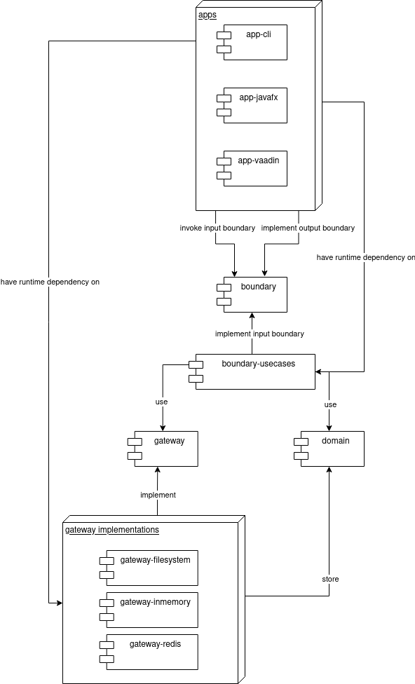

# Introduction and Goals

Pendenzenliste is a highly over-engineered application that can be used to manage todos.
The main goal of the project is to exercise designing a non-trivial application in a CLEAN-Architecture.

The users of the application define for themselves how they want to run the application.
This may mean that the app can be run in e.g. a web, CLI or android app.
If the user desires it the user should be able to synchronize the data between multiple of his personal devices.

## Requirements Overview

| ID                                                            | Requirement               | Description                                                                                                                             | Implemented |
|---------------------------------------------------------------|---------------------------|-----------------------------------------------------------------------------------------------------------------------------------------|-------------|
| M-1                                                           | Create todo               | Users should be able to create their todos                                                                                              | Yes         |
| M-2                                                           | Delete todo               | Users should be able to delete their todos                                                                                              | Yes         |
| M-3                                                           | Complete todo             | Users should be able to complete their todos                                                                                            | Yes         |
| M-4                                                           | Reset todo                | Users should be able to reset a previously completed todo                                                                               | Yes         |
| M-5                                                           | List todos                | Users should be able to list their todos                                                                                                | Yes         |
| M-6                                                           | Fetch todo                | Users should be able to fetch a specific todo                                                                                           | Yes         |
| M-7                                                           | Update todo               | Users should be able to update their open todos                                                                                         | Yes         |
| M-8                                                           | Storage gateway           | The application should have some kind of storage gateway to store the todos                                                             | Yes         |
| O-1                                                           | In-memory storage gateway | The application should support an in-memory storage gateway                                                                             | Yes         |
| [O-2](https://github.com/flens-dev/pendenzenliste/issues/1)   | File storage gateway      | The application should support a file storage gateway to persistently store todos                                                       | Yes         |
| [O-3](https://github.com/flens-dev/pendenzenliste/issues/2)   | Redis storage gateway     | The application should support a redis storage gateway to persistently store todos                                                      | Yes         |
| [O-4](https://github.com/flens-dev/pendenzenliste/issues/10)  | REST storage gateway      | The application should support a REST storage gateway to persistently store todos                                                       | No          |
| M-9                                                           | App                       | The pendenzenliste should be bundled into an application                                                                                | Yes         |
| O-5                                                           | javafx app                | The pendenzenliste should be bundled into a javafx application                                                                          | Yes         |
| [O-6](https://github.com/flens-dev/pendenzenliste/issues/7)   | vaadin app                | The pendenzenliste should be bundled into a vaadin application                                                                          | Yes         |
| [O-7](https://github.com/flens-dev/pendenzenliste/issues/12)  | cli app                   | The pendenzenliste should be bundled into a command line interface application                                                          | Yes         |
| [O-8](https://github.com/flens-dev/pendenzenliste/issues/13)  | i18n                      | The pendenzenliste should be translated into german and english                                                                         | No          |
| [O-9](https://github.com/flens-dev/pendenzenliste/issues/9)   | achievements              | The user should be able to earn achievements by interacting with the application                                                        | Yes         |
| [O-10](https://github.com/flens-dev/pendenzenliste/issues/16) | statistics                | Users should be able to view statistics of their usage                                                                                  | No          |
| [O-11](https://github.com/flens-dev/pendenzenliste/issues/17) | android app               | The pendenzenliste should be bundled into an android app                                                                                | No          |
| [M-10](https://github.com/flens-dev/pendenzenliste/issues/18) | subscribe todo list       | The user should be able to subscribe to a list of todos to update the displayed todos when another app or user updates the stored todos | Yes         |
| [O-12](https://github.com/flens-dev/pendenzenliste/issues/35) | Discord Bot               | The pendenzenliste should be accessible by interacting with a discord bot                                                               | Yes         |

Legend:

```
M = Must have requirement
O = Optional requirement
```

## Quality Goals

| ID  | Priority | Quality goal    | Description                                                                                                                 |
|-----|----------|-----------------|-----------------------------------------------------------------------------------------------------------------------------|
| Q-1 | 1        | Extendability   | The application should be easily extended by adding new frontend applications or gateways to support different technologies |
| Q-2 | 2        | Learnability    | The application should be self explanatory to the end users                                                                 |
| Q-3 | 1        | Configurability | The application should be configurable by end users to match their specific requirements and desires                        |

## Stakeholders

| Role/Name | Goal                                                            | Expectations |
|-----------|-----------------------------------------------------------------|--------------|
| User      | Wants to configure the app to his needs and to manage his todos |              |

# Architecture Constraints

| ID   | Description                                                     | 
|------|-----------------------------------------------------------------|
| AC-1 | The application should follow the CLEAN architecture principles |

# System Scope and Context

This section describes the systems internal scope and differentiates it from the users and systems that are
connected to it.

## Business Context

The business context describes the high-level context of the system.
It contains all of the systems users and connected systems, but does not go into technical details.
Its goal is to describe the systems context to non-technical stakeholders.


| Neighbour              | Description                                                              |
|------------------------|--------------------------------------------------------------------------|
| user                   | Manages his todos via the applications                                   |
| gateway implementation | Is accessed by the application to store and retrieve the users todo data |

## Technical Context

The technical context goes into more detail than the business context.
It contains the internal interfaces used to interact with the system and the external interfaces used to instrument
the connected systems.


The system is used by interactive users through different kinds of apps.
These may e.g. be desktop, mobile or cli apps.
Each app is implemented in its own separate module.

Applications may use the input boundaries provided by the boundary module to invoke the desired use cases.

The use cases will respond to the executed requests by calling the output boundaries with the appropriate responses to
the request. These responses can be used to update the views of the calling app.

The applications may be configured to use a variety of different gateway implementations.
These include filesystem, in-memory or redis storages for the data managed by the pendenzenliste.

_As the system is intended to be highly configurable we cannot make any assumptions on the supported or unsupported
protocols of the technical context._

# Solution Strategy

The following section describes the approach to implement the functional and non-functional requirements of the system.

# Building Block View

The following section describes the decomposition of the system into its atomic building blocks.
The chapters will allow you to zoom into different levels of detail as you explore the architecture.

## Whitebox Overall System

The following diagram describes the global modules and their dependencies on each other:



The following table describes the global modules and their purpose:

| Component           | Description                                                                                           |
|---------------------|-------------------------------------------------------------------------------------------------------|
| app-cli             | Provides the end user access to the pendenzenliste through a cli                                      |
| app-discord-bot     | Provides the end user access to the pendenzenliste through a discord bot                              |
| app-dropwizard      | Provides the end user access to the pendenzenliste through a RESTful API                              |                                                     
| app-javafx          | Provides the end user access to the pendenzenliste through a desktop javafx application               |
| app-vaadin          | Provides the end user access to the pendenzenliste through a web based vaadin application             | 
| boundary            | Defines the input and output boundaries that are used to provide access to the applications use cases |
| boundary-usecases   | An implementation of the apps input boundaries that represent the actual use cases of the application |
| domain              | Defines a bundle of the domains of the pendenzenliste                                                 |
| domain-achievements | Implements the achievement domain of the pendenzenliste                                               |
| domain-statistics   | Implements the statistics domain of the pendenzenliste                                                |
| domain-todos        | Implements the todo domain of the pendenzenliste                                                      |
| gateway             | Defines the public API of the gateways that are used to store the todos                               |
| gateway-filesystem  | An implementation of the gateway API that stores the todos in a filesystem                            |
| gateway-inmemory    | An implementation of the gateway API that stores the todos in an in-memory storage                    |
| gateway-redis       | An implementation of the gateway API that stores the todos in a redis instance                        |
| messaging           | Defines the APIs used to send messages through an event bus                                           |
| messaging-inmemory  | Implements the event bus interfaces defined in the messaging module for in-memory communication       |

### app-cli

Provides the end user access to the pendenzenliste through a cli.


The application is based on the Apache [commons-cli](https://commons.apache.org/proper/commons-cli/) module.

### app-discord-bot

*\<black box template\>*

### app-dropwizard


*\<black box template\>*

### app-javafx

*\<black box template\>*

### app-vaadin

*\<black box template\>*

### boundary

*\<black box template\>*

### boundary-usecases

*\<black box template\>*

### domain

The domain module bundles the concrete domain modules, so that other parts of the system may include the domain module
instead of implementing each of the domain modules separately.


### domain-achievements

*\<black box template\>*

### domain-statistics

*\<black box template\>*

### domain-todos

*\<black box template\>*

### gateway

*\<black box template\>*

### gateway-filesystem

*\<black box template\>*

### gateway-inmemory

*\<black box template\>*

### gateway-redis

*\<black box template\>*

### messaging

The messaging module provides the abstractions used for asynchronous messaging within the system.
These are mostly used to synchronize domain specific events between different domain modules.

The abstractions can be implemented by different modules, e.g. in order to make use of some specific messaging solution.


### messaging-inmemory

*\<black box template\>*

### util-serialization

*\<black box template\>*

## Level 2

### White Box *\<building block 1\>*

*\<white box template\>*

### White Box *\<building block 2\>*

*\<white box template\>*

...

### White Box *\<building block m\>*

*\<white box template\>*

## Level 3

### White Box \<\_building block x.1\_\>

*\<white box template\>*

### White Box \<\_building block x.2\_\>

*\<white box template\>*

### White Box \<\_building block y.1\_\>

*\<white box template\>*

# Runtime View

## \<Runtime Scenario 1\>

- *\<insert runtime diagram or textual description of the scenario\>*

- *\<insert description of the notable aspects of the interactions
  between the building block instances depicted in this diagram.\>*

## \<Runtime Scenario 2\>

## ...

## \<Runtime Scenario n\>

# Deployment View

## Infrastructure Level 1

***\<Overview Diagram\>***

Motivation

:   *\<explanation in text form\>*

Quality and/or Performance Features

:   *\<explanation in text form\>*

Mapping of Building Blocks to Infrastructure

:   *\<description of the mapping\>*

## Infrastructure Level 2

### *\<Infrastructure Element 1\>*

*\<diagram + explanation\>*

### *\<Infrastructure Element 2\>*

*\<diagram + explanation\>*

...

### *\<Infrastructure Element n\>*

*\<diagram + explanation\>*

# Cross-cutting Concepts

The following section describes important cross-cutting concerns that should be consistent across building block
boundaries.

Being familiar with those concepts should make implementing new features easier, but they may also have drawbacks, that
we haven't properly taken into consideration yet.

## Build Tools

### Gradle

The project uses gradle as the central build tool.

In order to make using the gradle builds a bit easier there is a Makefile present in the root module.
Make provides the means to autocomplete build targets in the CLI process.

### Gradle Submodules

The submodules `build.gradle` files are thinned out as much as possible.
To achieve this the `build.gradle` file in the root module configure the included subprojects with reasonable defaults.
This includes adding dependencies for frameworks used for testing, static analysis, etc.
Each submodule should then define their own dependencies, but not much else.

### CI Builds

The project uses [github actions](https://github.com/flens-dev/pendenzenliste/actions) for the automated CI builds.

## Design Patterns

The following section describes the design patterns, that are used within the code base.

### Controller

A `Controller` creates a `Request` and invokes the appropriate `InputBoundary` with it.

The `Controller` is not accessed directly, but rather listens to events from the application and acts as it seems fit to
those events.

### Entity

An `Entity` is some kind of persistent object that belongs to the domain.

It may contain other `ValueObject`s.

Each `Entity` is accessed through an appropriate `Gateway`.

### Event

An `Event` describes some kind of meaningful state change within the application or domain that happened in the past.

## Gateway

A gateway provides access to some kind of external system such as a database or a REST API.

### InputBoundary

An `InputBoundary` defines a public interface for objects that handle the `UseCase` specific inputs of the application.
It receives a `Request` and an `OutputBoundary` and produces a `Response`.
The `Response` will then be used to update the `OutputBoundary`.

### OutputBoundary

An `OutputBoundary` defines a public interface for objects that handle the responses of the applications `UseCase`s.

### Page

A `Page` is an application specific wrapper for a view that is used to register handlers and do some general wiring for
the view.
This pattern can be used in the context of a framework that has no other means to register those resources, but should
only allow sane dependencies.

### Presenter

A `Presenter` is an application specific implementation of an `OutputBoundary`.
The `Presenter` modifies the `ViewModel`, which is bound to a `View`, so the `Presenter` indirectly modifies the data
displayed by the `View`.

### Request

A `Request` encapsulates the data used to invoke an `InputBoundary` in a technology-agnostic format.
The `Request` may only contain native datatypes, such as strings, integers, etc., or `RequestModel`s.

### RequestModel

A `RequestModel` encapsulates complex data structures that may be a member of a `Request`, but cannot be represented in
a primitive datatype.

An example for this would be a list of key value pairs that need to be passed to the `InputBoundary`.

### Response

A `Response` encapsulates the data used to invoke an `OutputBoundary` in a technology-agnostic format.

The `Response` may only contain native datatypes, such as strings, integers, etc., or `ResponseModel`s.

### ResponseModel

A `ResponseModel` is a technology-agnostic model that may be contained in a `Response`.

The `ResponseModel` may represent some kind of `Entity` without exposing the actual data types of the domain module.

### UseCase

A `UseCase` implements an `InputBoundary` and encapsulates the interactions required to fulfill some kind of goal within
the application.

### ValueObject

A `ValueObject` represents some kind of domain-specific data type.

### View

A `View` provides a user the means to look at and enter new data into the application.

It binds to a `ViewModel`, which stores all the data used to display the data for the end user.

### ViewModel

A `ViewModel` is an application-specific model of the data displayed by a `View`.
The `ViewModel` provides means for a `View` to bind to its properties.
Both the `Presenter` and `View` may update the properties to store the displayed data.

# Architecture Decisions

This section describes the most important architecture decisions that were made for the project.

# Quality Requirements

This section describes the quality requirements for the system.
The quality requirements are specified through quality goals.
In order to gather measurable feedback for the quality goals, they are explicitly specified with quality scenarios.

## Quality Tree

## Quality Scenarios

# Risks and Technical Debt

This section describes the risks and technical debt that has accrued in the project.

## Multi tenancy

As of now the application only supports unauthenticated access to the application.
In case that the application should ever need to support multi tenancy some major changes need to be introduced.

## PMD warnings

As of now the code contains some PMD warnings that will be recorded on each build.
This is due to the project not having a custom PMD ruleset yet.

## Use of java serialization

The gateways currently make use of the standard java serialization features.
This means that they are dependent on the versions that wrote the entities and the versions that read the entities.

In case that the entities are written with an older version and are read by a newer version at a later point in time,
then reading may fail in case that they are not compatible with each other anymore.

This may happen whenever enum or domain types are extended in the domain modules.

## In-memory Event Bus

The application currently uses an in-memory event bus to notify interested parties about events that occurred.
This is ok, as long as the application is not run in a distributed style, but that may change in the future.

This also means, that there is currently no guarantee that the subscribers are only notified once for each of the
events.

## Flaky Github builds

Due to the integration tests the builds on Github fail from time to time, even though they run perfectly on your
machine.

## Versioning

As of now the project is not properly versioned, as there are no artefacts published yet.
This must be addressed, as soon as publishing artefacts becomes necessary.

## Explicit runtime dependencies

The app modules currently define runtime dependencies on the desired modules explicitly.
This has been convenient for local testing purposes, but must be addressed to actually enable users to configure their
desired deployment or extend the system by themselves.

## Configurability

The system is currently not configurable, as the only external service connected currently is the redis gateway.
All the parameters are either hardcoded or default values.
This must be addressed to enable users to configure their system as they please.

## Running the apps from IntelliJ IDEA

The apps may not be executable from the gradle integration in the IntelliJ IDEA.
This is due to an existing bug in the IDE.
Further details can be found [here](https://github.com/flens-dev/pendenzenliste/issues/6).

# Glossary

The following section describes the terms and abbreviations used to describe the software.

| Term        | Definition                                              |
|-------------|---------------------------------------------------------|
| achievement | The user can earn achievements by working with todos    |
| api         | Advanced programming interface                          |
| cli         | Command line interface                                  |
| event       | An domain specific event that occurred in the past      |
| todo        | A task that the user wants to complete                  |
| vaadin      | Vaadin is a modern web framework for the java ecosystem |
